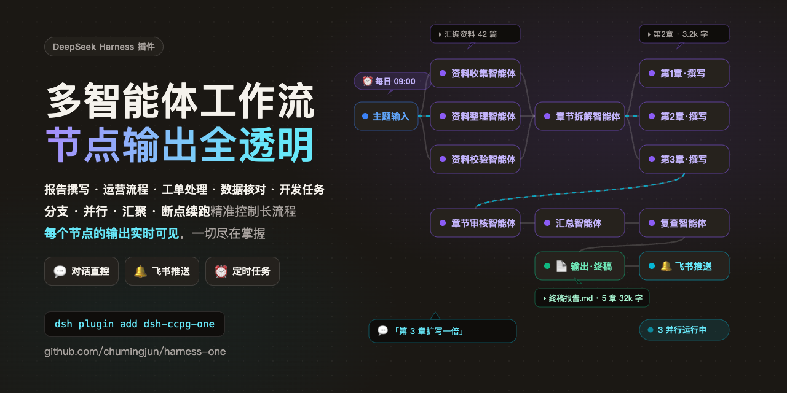
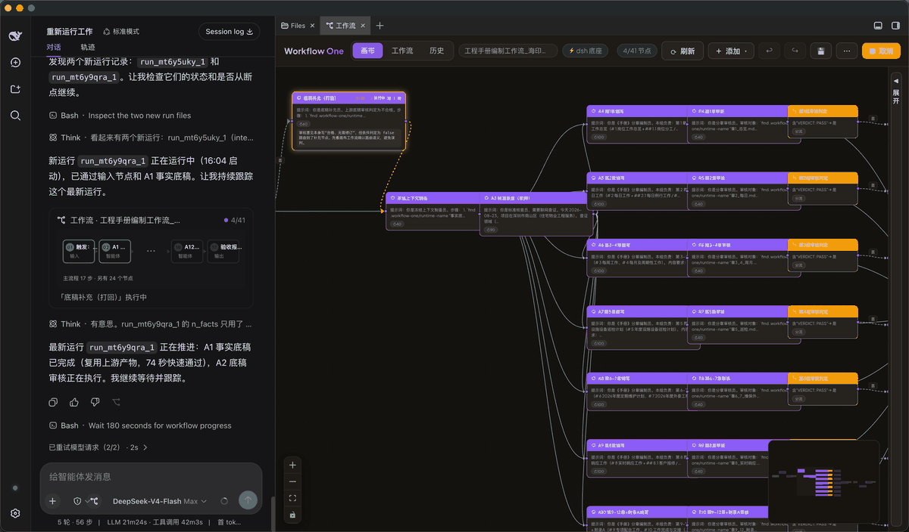

<p align="right">
  <a href="./README.md">简体中文</a> · <strong>English</strong>
</p>

# Workflow One

<p align="center">
  
</p>

<p align="center">
  <a href="https://github.com/deepseek-ai/deepseek-harness"></a>
  <a href="https://www.npmjs.com/package/dsh-ccpg-one"></a>
  <a href="https://github.com/chumingjun/harness-one/actions/workflows/ci.yml"></a>
  <a href="https://github.com/chumingjun/harness-one/releases/latest"></a>
  <a href="./LICENSE"></a>
</p>

## Turn real agents into observable workflows

`Workflow One` is a visual AI workflow orchestrator for [DeepSeek Harness (dsh)](https://github.com/deepseek-ai/deepseek-harness). Build DAGs from real dsh agents, scripts, conditions, and HTTP nodes; start them from the canvas or chat; inspect every node's input, output, and artifacts; and resume interrupted runs without starting over.

## Why Workflow One?

| Capability | What changes |
| --- | --- |
| **Visual orchestration** | Express sequential, parallel, and conditional paths as nodes and edges instead of hiding the process in a prompt. |
| **Real dsh agents** | Each agent node uses dsh models, tools, and Skills, with different models and roles on the same canvas. |
| **Observable runs** | Inspect live state, actual inputs, outputs, tokens, traces, and artifacts while concurrent runs stay isolated. |
| **Recoverable execution** | Retry, timeout, continue after failure, or resume from an interruption instead of rerunning the whole workflow. |
| **Multiple triggers** | Start from the canvas, chat, a webhook, or cron; the AI assistant can also inspect, edit, and run workflows. |
| **Deliverable results** | Preview or download artifacts and send progress or final results to Feishu groups and users. |

## Install

> [!NOTE]
> Requires Node.js >= 22.13.0 and [DeepSeek Harness](https://github.com/deepseek-ai/deepseek-harness): `npm i -g @deepseek-ai/dsh`.

### npm

```sh
dsh plugin --profile web add dsh-ccpg-one@latest
dsh web
```

Harness Desktop users should open **Open DSH Terminal**, run `dsh plugin add dsh-ccpg-one@latest`, and restart Desktop. Do not run `setup.sh` in Desktop; it manages its own profile, Node/pnpm runtime, and loopback port. See [Desktop setup and troubleshooting](dsh-plugins/DESKTOP.md).

### Offline bundle

Download the prebuilt bundle from [GitHub Releases](https://github.com/chumingjun/harness-one/releases/latest):

```sh
curl -LO https://github.com/chumingjun/harness-one/releases/download/<tag>/dsh-ccpg-plugins-<tag>.tar.gz
tar -xzf dsh-ccpg-plugins-<tag>.tar.gz && cd dsh-plugins
sh setup.sh --one wf1 4021
sh start.sh wf1                         # http://127.0.0.1:4021/
```

### Build from source

```sh
git clone https://github.com/chumingjun/harness-one.git
cd harness-one
npm install
npm --prefix web install
sh dsh-plugins/build-web.sh             # Required for source installs
sh dsh-plugins/setup.sh --one dev 4021
sh dsh-plugins/start.sh dev
```

Models and API keys are managed entirely by the dsh profile. This repository and its plugins never hard-code or store keys. See [`dsh-plugins/README.md`](dsh-plugins/README.md) for complete setup, configuration, and development details.

## How it works

Workflow One lives inside the official dsh interface: the conversation remains visible on the left, with a zoomable workflow canvas beside it.

1. Open **Workflow** beside the dsh chat input, then create or load a workflow.
2. Add input, agent, script, condition, HTTP, output, notification, or note nodes and configure their prompts, variables, tools, and models.
3. Save and run from the canvas, or ask the AI assistant in chat to inspect, edit, and run the workflow.
4. Select a running node to inspect its actual input and execution details, then review the timeline, final result, and artifacts in the result panel.



[View the full-resolution screenshot](images/workflow01.png)


## Workflow Notifications

The notification node observes the whole run. It can be connected inline as a pass-through node or left unconnected; both placements behave the same. The initial provider sends Feishu interactive cards, while the channel-neutral event layer is ready for future DingTalk and WeCom providers.

- **Run completion** sends one result card when the workflow succeeds, fails, or is canceled.
- **Every node** sends a compact update after each business node succeeds or fails, followed by the final result card.
- **Group delivery** uses a `chat_id` beginning with `oc_`; the application bot must be in that group.
- **Direct delivery** uses a user's `open_id` beginning with `ou_`; the application visibility range and bot messaging relationship must include that user.

Cards show progress, duration, node counts, output summaries, and failure or cancellation details. Common secret values are redacted and summaries are truncated. Delivery failures are recorded on the notification node without changing the business workflow status. Configure the self-built Feishu application's App ID and App Secret in the canvas settings; these credentials are separate from the lark-cli user login.

## Importable Examples

[`examples/workflows/`](examples/workflows/) contains three ready-to-import workflows: repair ticket normalization, urgency routing, and parallel review. Open the Workflow list, choose **Import**, and select a `.workflow-one.json` file.

## Packages

The default bundle contains `dsh-ccpg-tools`, `dsh-ccpg-orchestrator`, `dsh-ccpg-web`, `dsh-ccpg-canvasui`, `dsh-ccpg-document-preview`, `dsh-ccpg-larkauth`, and `dsh-ccpg-llm-guard`. `dsh-ccpg-brand` is an optional standalone package.

See [dsh-plugins/README.md](dsh-plugins/README.md) for installation, packaging, architecture, and storage details.

## Contributing and Security

- [Contributing guide](CONTRIBUTING.md)
- [Security policy](SECURITY.md)
- [Code of conduct](CODE_OF_CONDUCT.md)
- [Discussions](https://github.com/chumingjun/harness-one/discussions)

Licensed under the [MIT License](LICENSE).
