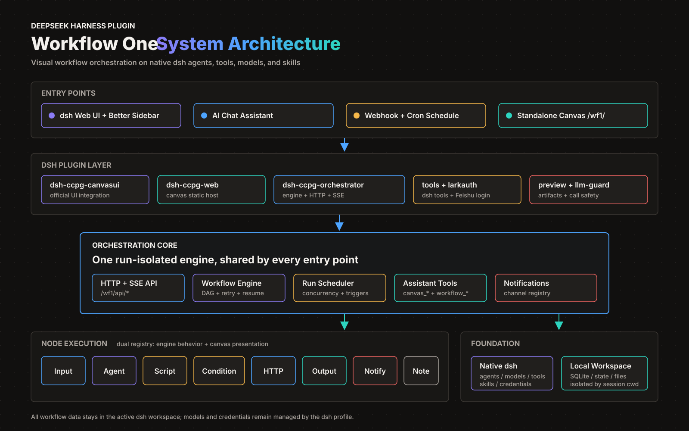

<p align="right">
  <strong>简体中文</strong> · <a href="./README.en.md">English</a>
</p>

# Workflow One

<p align="center">
  
</p>

<p align="center">
  <a href="https://github.com/deepseek-ai/deepseek-harness"></a>
  <a href="https://zcode.z.ai/cn"></a>
  <a href="https://www.npmjs.com/package/dsh-ccpg-one"></a>
  <a href="https://github.com/chumingjun/harness-one/actions/workflows/ci.yml"></a>
  <a href="https://github.com/chumingjun/harness-one/releases/latest"></a>
  <a href="./LICENSE"></a>
</p>

## 一句话，把真实 Agent 变成可观察的工作流

`Workflow One` 是运行在 [DeepSeek Harness（dsh）](https://github.com/deepseek-ai/deepseek-harness) 中的可视化 AI 工作流编排器。用拖拽 DAG 组合真实 dsh agent、脚本、条件分支和 HTTP 节点，在画布或对话中启动流程，实时查看每个节点的输入、输出和产物，失败后从中断处恢复。

## 为什么需要 Workflow One？

| 能力 | 带来的变化 |
| --- | --- |
| **可视化编排** | 用节点和连线表达串行、并行与条件分支，复杂流程不再藏在提示词里。 |
| **真实 dsh Agent** | 每个智能体节点直接使用 dsh 的模型、工具和 Skill，同一张图可组合不同模型与职责。 |
| **运行全透明** | 实时查看节点状态、实际输入、输出、token、trace 和产物，多次运行可并发且互不干扰。 |
| **可恢复执行** | 节点支持超时、重试、失败继续和断点续跑，不必因单点异常从头执行。 |
| **多入口触发** | 可从画布、对话、Webhook 或 cron 定时启动；AI 助手也能查询、修改和运行工作流。 |
| **结果可交付** | 结果与文档产物可预览、下载，也可通过飞书群聊或私聊推送进度和最终结果。 |

## 安装

> [!NOTE]
> 需要 Node.js >= 22.15.0（dsh 本体用到 `node:zlib` 的 zstd API，22.15 起提供），并已安装 [DeepSeek Harness](https://github.com/deepseek-ai/deepseek-harness)：`npm i -g @deepseek-ai/dsh`。

### npm

```sh
dsh plugin --profile web add dsh-ccpg-one
dsh web
```

[Harness Desktop](https://github.com/anywhere-labs/deepseek-harness-desktop) 用户从托盘打开 **Open DSH Terminal**，执行 `dsh plugin add dsh-ccpg-one` 后重启 Desktop。不要在 Desktop 中运行 `setup.sh`，Desktop 会自行管理 profile、Node/pnpm 和随机 loopback 端口。详见 [Desktop 安装与排障](dsh-plugins/DESKTOP.md)。

**界面依赖说明**：Workflow One 在 dsh 官方界面中的「工作流」画布由开源项目 [DSH-better-sidebar](https://github.com/omdsh-dev/DSH-better-sidebar) 提供侧栏与标签页宿主，`dsh-ccpg-one` 会自动安装并依赖它。未安装或禁用 DSH-better-sidebar 时，官方界面内嵌的「工作流」入口不可用，但独立画布 `/wf1/` 仍可访问。

### 离线包

从 [GitHub Releases](https://github.com/chumingjun/harness-one/releases/latest) 下载聚合包，无需仓库源码：

```sh
curl -LO https://github.com/chumingjun/harness-one/releases/download/<tag>/dsh-ccpg-plugins-<tag>.tar.gz
tar -xzf dsh-ccpg-plugins-<tag>.tar.gz && cd dsh-plugins
sh setup.sh --one wf1 4021
sh start.sh wf1                         # http://127.0.0.1:4021/
```

### 从源码构建

```sh
git clone https://github.com/chumingjun/harness-one.git
cd harness-one
npm install
npm --prefix web install
sh dsh-plugins/build-web.sh             # 源码安装必跑，构建产物不入库
sh dsh-plugins/setup.sh --one dev 4021
sh dsh-plugins/start.sh dev
```

模型和密钥完全由 dsh profile 管理。插件使用 dsh 默认模型栈，也支持在 `cordis.patch.yml` 或 `~/.dsh/settings.yaml` 中追加 provider；本仓库和插件不写死、不存储任何 key。完整安装、配置与开发循环见 [`dsh-plugins/README.md`](dsh-plugins/README.md)。

> 普通 dsh 的 lark-cli 由 `setup.sh` 或插件自举安装；Desktop 仅在用户明确点击后通过受管 pnpm 安装。

## 界面与使用方式

Workflow One 嵌在 dsh 官方界面中：左侧保留与智能体的对话，中间是可缩放的工作流画布。节点按连线组成 DAG，可以串行执行，也可以并行分组、条件分支和失败打回；运行时节点会直接显示排队、执行、成功或失败状态。

1. 在 dsh 对话输入框旁打开「工作流」，新建工作流或载入已有流程。
2. 从工具栏添加输入、智能体、脚本、条件、HTTP、输出、消息通知等节点，连线后配置提示词、变量、工具和模型。
3. 保存并从画布启动，也可以在左侧对话中让 AI 助手检查、修改和运行当前工作流。
4. 点击运行中的节点查看实际输入与执行详情，在右侧「过程 / 成果 / 问题」中查看时间线、最终结果和产物。


[查看完整分辨率截图](images/workflow01.png)

下图展示同一次运行的协同视图：左侧对话持续跟踪进度，中间选中正在执行的节点并查看配置，右侧按拓扑顺序展示每个节点的运行状态。


## 可导入模板

[`examples/workflows/`](examples/workflows/) 提供三套可直接导入的工作流：报修工单整理、紧急度分流和多方并行评审。打开「工作流」列表，点击「导入」并选择 `.workflow-one.json` 文件即可使用。

## 画布能力

**8 种节点类型**：输入 / 智能体 / **脚本（QuickJS 沙箱）** / 条件分支 / HTTP 请求 / 输出 / 消息通知 / 注释。

- **可拖拽画布**（React Flow）：连线（禁自环/环检测）、缩放、小地图、框选、快捷键（Cmd+S 保存 / Cmd+Z 撤销 / Delete 删除 / Cmd+D 复制 / F 定位错误）
- **智能体节点**：提示词 + 工具勾选（read_file / web_fetch / feishu_doc_read / feishu_doc_write）；节点级模型与渠道（GLM anthropic 订阅 / openai 按量、DeepSeek），同图不同节点可组队；工具循环轮数上限；Plan-Execute 三阶段模式（规划→逐步执行→总结，planTrace 全程记录）；技能 = dsh 原生 skill 工具（`ctx.skills` 目录，节点可勾选定向提示）
- **脚本节点**：QuickJS 沙箱执行同步 `function main(input, workspace)` 返回 JSON。命名参数支持「表达式」（完整变量，仅直接上游）或「JSON 常量」；workspace 仅可 list/read/write/remove 本节点目录（拒绝穿越/反斜杠/符号链接）；超时 100–10000ms；可选 outputSchema 校验（失败即节点失败）；返回值进变量树
- **变量系统**：模板编辑器（输入 `{{` 或 `/变量` 搜索字段树）覆盖全部模板位；稳定 ID 引用 `{{node["n_http_1"].data.json.customer.name}}`、缺省值 `| default("x")`、`{{$trigger}}` / `{{$upstream}}`；改名联动全图替换；旧 `{{节点名}}` 语法兼容
- **运行与调试**：SSE 实时状态（queued/running/success/error/skipped）；就绪即发并发调度；分支容错（单支失败不拖垮其余）；节点重试 / 失败继续 / 超时；运行取消 / 重放 / 导出；试运行（手填假输入、关闭即中断）；节点级运行详情（实际输入、产物、token 用量、trace）
- **多运行并发**：同一工作流可同时运行多个实例（节点工作区 / 产物 / 日志 / 取消按 runId 互不干扰）；成果面板顶部运行胶囊条随时切换查看任一运行（LIVE 优先、含来源图标与实时进度），画布节点状态随选中运行联动；定时 / Webhook 触发的运行不抢占当前视图，以 toast + 胶囊提示
- **结果面板**：时间线按图拓扑稳定排序（跳过分支也可见）；最终结果取输出节点、失败不被中间结果顶替；过程产物折叠分组；产物流式下载（Range 206 / 统一 MIME / HTML sandbox CSP）与全屏预览（PDF/DOCX/XLS(X)/PPTX 本地渲染）
- **消息通知节点**：运行级观察器，可独立放置或在线路中透传；支持仅运行结束、每个业务节点完成两种模式；当前通过飞书消息卡片推送到群聊或私聊，渠道层可继续扩展钉钉和企业微信
- **触发与集成**：webhook（token 鉴权）、cron 定时（画布「⋯ → 定时任务」可视化管理：预设 + 自定义表达式、下 3 次触发预览、重叠策略可选跳过/并行、立即运行、停用与编辑）、飞书写回（输出节点可选）
- **持久化**：工作流库（命名工作流 CRUD）、运行历史（含 graph 快照）、重启恢复（触发器落盘 + 链式定时等待，含触发/跳过统计）
- **可靠性**：保存失败 toast 报错并中止运行；命名工作流运行带 graphFingerprint 指纹校验（409 拒绝跑错版本）

## 画布 AI 助手

官方 dsh Web UI 的聊天里直接改图（同 session，经 canvas_* 工具落图）：`canvas_get_graph` / `canvas_graph_summary` / `canvas_graph_patch`（批量原子操作，含 script 节点契约）/ `canvas_lint_graph` / `canvas_run_workflow` / `canvas_run_status`。点击对话输入框旁的工作流按钮，在右侧 better-sidebar 打开当前 session 的画布；主区对话持续可见。

**workflow_* 工具家族**（按工作流 id/name 操作，不依赖画布绑定，任意官方聊天会话可用；按会话 cwd 定工作区）：

- 查询：`workflow_list`（清单+各 live 运行数）/ `workflow_get`（概要省 token 或完整图）/ `workflow_runs`（live 优先+最近 N，可过滤）/ `workflow_run_status`（单 run 详情）
- 运行：`workflow_run`（异步返回 runId）/ `workflow_run_cancel`（按 runId、工作流或 all 批量）
- 管理：`workflow_patch`（原子改图+可选改名，正打开的画布实时同步）/ `workflow_create` / `workflow_delete`（confirm 门 + live/webhook/定时关联守卫）/ `workflow_open`（把绑定画布切到指定工作流，SSE 联动）

## 飞书

- **账号登录**：官方 dsh Web UI 设置面板「飞书账号」扫码（lark-cli Device Flow，token 由 CLI 自管零落盘）；user token 后台自动续约（refresh 轮换，授权长期有效）
- **凭据**：画布 ⚙ 设置弹窗管理多套自建应用凭据（掩码/默认切换/输出节点可选）
- **工作流通知**：消息通知节点使用自建应用凭据，以机器人身份向群聊或用户私聊发送运行进度与结果卡片
- **技能**：feishu-cli 技能由 larkauth 种子到 dsh 原生技能根 `~/.dsh/skills`（官方聊天 agent 与画布 agent 共用）；agent 默认 `--as user`，失败降级 `--as bot`

### 消息通知节点

通知节点不承担业务计算，而是观察整次运行，因此既可以串在连线上透传上游输出，也可以不连线独立放在画布上。两种放置方式的通知行为一致。

1. 在画布右上「设置」中添加飞书自建应用的 App ID / App Secret；这与「飞书账号」扫码登录是两套独立凭据。
2. 添加「消息通知」节点，选择飞书渠道和应用凭据。
3. 选择接收方式：群聊填写 `oc_` 开头的 `chat_id`，机器人必须已加入目标群；私聊填写 `ou_` 开头的用户 `open_id`，应用可用范围必须包含该用户并允许机器人向其发消息。
4. 选择通知模式：**仅运行结束**会在成功、异常终止或取消时发送结果卡；**每个节点完成**会在每个业务节点成功或失败后发送紧凑进度卡，并在运行结束后追加结果卡。

进度卡包含节点状态、整体进度、节点耗时和输出摘要；结果卡包含最终状态、成功/失败/取消/跳过节点统计、起止时间、总耗时、最终输出摘要，以及异常或取消原因。摘要会截断并脱敏常见 token、密码和密钥字段。通知发送失败只记录在通知节点的运行元数据中，不会把已完成的业务工作流改成失败。

典型使用场景：

- 定时巡检、日报或数据同步完成后，把最终结果推送到业务群
- 长耗时多节点流程逐步播报进度，让协作群及时看到卡点
- 工作流异常或被取消时立即发送失败节点与原因，便于值班响应
- 将审批准备、工单处理或个人自动化结果私聊给指定负责人，减少群消息干扰

## 插件形态（dsh-ccpg 系）

| 包 | 安装方式 | 职责 |
|---|---|---|
| `dsh-ccpg-tools` | 默认 | feishu_doc_read / feishu_doc_write 注册 `ctx.tools` |
| `dsh-ccpg-orchestrator` | 默认 | DAG 调度 + 节点级 `ctx.agents` 进程内 agent + QuickJS 脚本节点 + `/wf1/api/*` HTTP/SSE |
| `dsh-ccpg-web` | 默认 | 画布静态托管 `/wf1/`（SPA fallback） |
| `dsh-ccpg-canvasui` | 默认 | 官方 dsh Web UI 输入框工作流按钮 + better-sidebar「工作流」画布（软依赖） |
| `dsh-ccpg-document-preview` | 默认 | 文档全屏预览（pdfjs / docx-preview / sheetjs / @file-viewer/pptx，inline workers、无第三方上传） |
| `dsh-ccpg-larkauth` | 默认 | 飞书扫码登录（启动自举、token 续约、技能种子）；官方设置面板「飞书账号」section |
| `dsh-ccpg-llm-guard` | 默认 | 模型工具调用完整性防护：空 id/name/arguments 自动重试，不写入会话 |
| `dsh-ccpg-brand` | 独立可选 | 品牌定制（CCPG logo + 聊天 hero 标题）；`setup.sh` 与 `dsh-ccpg-one` 均不安装 |

安装 / 打包 / 数据位置见 [dsh-plugins/README.md](dsh-plugins/README.md)。

## HTTP API（`/wf1/api/*`，挂在 dsh webServer）

| 分组 | 端点 |
|---|---|
| 图 | `GET/PUT /graph`、`POST /graph/reset`、`POST /graph/lint` |
| 工作流库 | `GET/POST /workflows`、`GET/PATCH/DELETE /workflows/detail`、`POST /workflows/transfer` |
| 运行 | `POST /run`、`POST /run/cancel`、`GET /runs`、`GET /runs/detail`、`GET /runs/export`、`POST /runs/replay`、`GET /run-results`、`GET /run-artifact` |
| 节点 | `POST /node/test`（试运行）、`GET /node-detail` |
| 产物 | `GET /artifact`（节点工作区文件，支持 preview/Range）、`GET/POST /attachments` |
| 触发 | `GET/POST/DELETE /hooks`（webhook，token 鉴权）、`GET/POST/PATCH/DELETE /schedule`（cron，含 overlap/启停）、`POST /schedule/preview`（下 3 次触发）、`POST /schedule/run`（立即运行） |
| 变量/模板 | `GET /variables/describe`、`GET/POST /global-variables`、`POST /template/render`、`POST /template/validate` |
| 配置 | `GET /tools`、`GET /skills`、`GET /llm-config`、`GET/POST /runtime-config`、`GET/POST/DELETE /feishu-credentials`、`GET/POST /lark-auth` |
| AI 助手 | `POST /assistant/bind` / `unbind`、`GET /assistant/canvas-state` |
| 实时 | `GET /events`（SSE）、`GET /state` |

## 环境变量

本仓库没有自己的配置文件，模型/渠道完全跟随 dsh profile 的配置（`apiKeyEnv` 声明 key 变量名），技能目录走 dsh 原生 `~/.dsh/skills` / `~/.agents/skills` 发现根。插件路径没有自创的环境变量。


## 架构



双端节点注册表：引擎 NodeKind（调度/超时/重试）+ 前端 registry（图标/表单/徽标），新节点两处注册即得全部能力。agent 节点 = `ctx.agents.create` 进程内真实 dsh agent（followup → whenIdle → session events 聚合，同官方 headless 驱动）。

## 已知 dsh 插件开发事实（踩坑记录）

- `defineTool` 必须带 `output: { schema, render }`（文本工具 schema `{type:'string'}`）
- `ctx.webServer.register` 路由形状 `{kind:'exact'|'prefix', path, handler}`，重复 path 抛错
- 给 `ctx` 挂自定义属性需 `provide` 声明；插件包里 `@deepseek-ai/*` 依赖需 file: 软链（`bootstrap-deps.sh`）
- dsh 浏览器端 module-loader 禁跨插件值导入——插件 client bundle 必须自包含
- dsh 官方 UI 远程 403 = PRIVILEGED_METHODS 钉死 loopback（安全设计）；插件自有路由不受影响
- dsh 进程内 fetch 127.0.0.1 自请求 404，需换 LAN IP；官方 UI 首载慢，E2E 等待要放宽

## 测试

```sh
cd dsh-plugins/dsh-ccpg-orchestrator && for t in test/*.test.mjs; do node "$t"; done
node dsh-plugins/dsh-ccpg-canvasui/test/client.test.mjs
node dsh-plugins/dsh-ccpg-document-preview/test/index.test.mjs
cd web && npm test
```

## 已知限制

- 飞书写回为追加段落块，不保留富文本格式
- 工作流与运行记录按工作区存入 `.workflow-one/workflow-one.sqlite`；state、附件与运行产物仍为本地文件

## 致谢

本项目 90% 以上的开发工作使用 [ZCode](https://zcode.z.ai/cn) 完成，感谢 ZCode 提供的开发平台与支持。

## 反馈

- 🐛 安装失败 / 运行报错：[提 Issue](https://github.com/chumingjun/harness-one/issues/new?template=bug_report.md)
- 💡 功能建议：[提 Issue](https://github.com/chumingjun/harness-one/issues/new?template=feature_request.md)
- 💬 使用提问、工作流配置求助、展示你搭的流程：[Discussions](https://github.com/chumingjun/harness-one/discussions)
