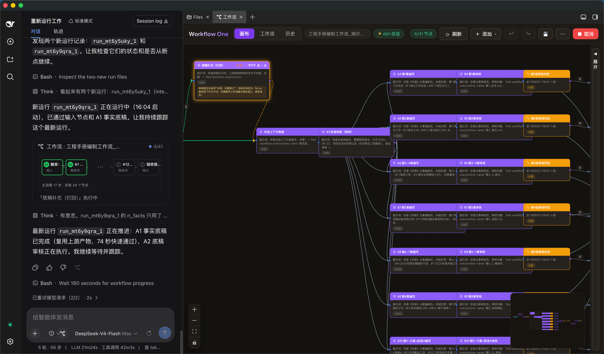
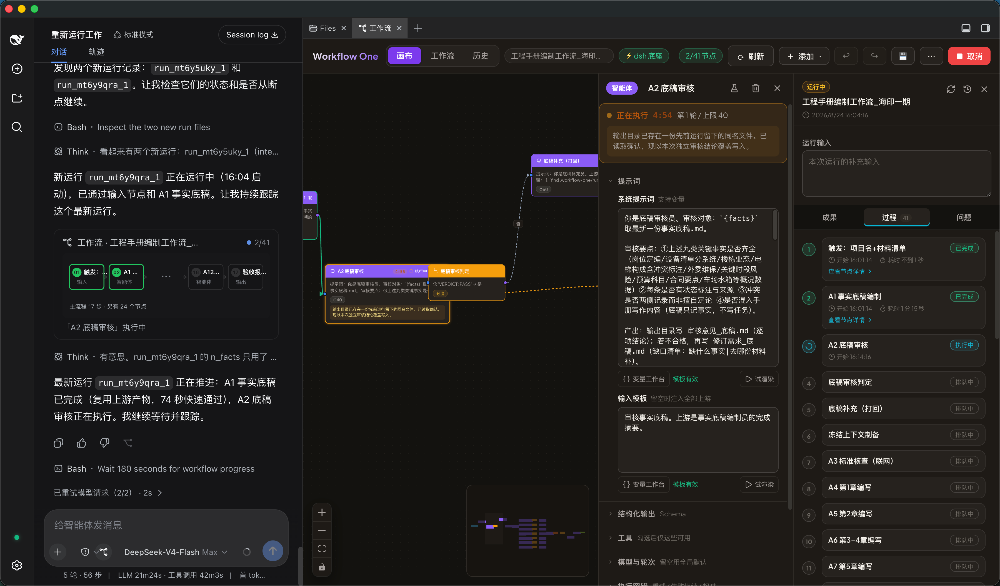

# Workflow One

**运行在 [DeepSeek Harness（dsh）](https://github.com/deepseek-ai/deepseek-harness) 中的可视化 AI 工作流编排器。** 用拖拽 DAG 组合真实 dsh agent、脚本、条件分支和 HTTP 节点，实时查看运行进度，异常后从中断节点恢复，并将成果写回飞书。

[](https://www.npmjs.com/package/dsh-ccpg-one)
[](https://github.com/chumingjun/harness-one/actions/workflows/ci.yml)
[](https://github.com/chumingjun/harness-one/releases/latest)
[](LICENSE)



## 立即安装

Node.js >= 24.15 且已安装 `@deepseek-ai/dsh`：

```sh
dsh plugin --profile web add dsh-ccpg-one@0.2.1
dsh web
```

Harness Desktop 用户在 **Open DSH Terminal** 中执行 `dsh plugin add dsh-ccpg-one@0.2.1`，然后重启 Desktop。也可以从 [GitHub Releases](https://github.com/chumingjun/harness-one/releases/latest) 下载离线聚合包。

## 界面与使用方式

Workflow One 嵌在 dsh 官方界面中：左侧保留与智能体的对话，中间是可缩放的工作流画布。节点按连线组成 DAG，可以串行执行，也可以并行分组、条件分支和失败打回。紫色节点是智能体，橙色节点负责条件判定；运行时节点会直接显示排队、执行、成功或失败状态。

典型使用流程：

1. 在 dsh 对话输入框旁打开「工作流」，新建工作流或载入已有流程。
2. 从工具栏添加输入、智能体、脚本、条件、HTTP、输出等节点，连线后在节点面板配置提示词、变量、工具和模型。
3. 保存并从画布启动，也可以在左侧对话中让 AI 助手检查、修改和运行当前工作流。
4. 运行卡实时显示已完成节点数和当前节点；点击节点查看实际输入与执行详情，在右侧「过程 / 成果 / 问题」中查看时间线、最终结果和产物。

下图展示同一次运行的协同视图：左侧对话持续跟踪进度，中间选中正在执行的节点并查看配置，右侧按拓扑顺序展示每个节点的运行状态。



## 快速开始

**Harness Desktop（npm 包发布后）**：从 Desktop 托盘打开 **Open DSH Terminal**，对当前 profile 安装并重启 Desktop：

```sh
dsh plugin add dsh-ccpg-one@0.2.1
```

Desktop 使用官方 DSH/Cordis 插件组合，不需要另一套插件。不要在 Desktop 里运行 `setup.sh`：Desktop 自己管理 profile、Node/pnpm 和随机 loopback 端口；飞书账号页首次点击「自动安装」时，lark-cli 会通过 Desktop 的受管 pnpm 安装到当前 profile。安装使用细节、环境差异与常见问题排查见 [`dsh-plugins/DESKTOP.md`](dsh-plugins/DESKTOP.md)；Desktop 开发兼容契约（`desktopProfiles`/`desktopPnpm` 动态探测、跨环境插件写法）也在该文档第 2 节。

**普通用户（release 包，无需本仓库源码）**：

```sh
# 前提：node>=24.15、npm i -g @deepseek-ai/dsh
curl -LO https://github.com/chumingjun/harness-one/releases/download/<tag>/dsh-ccpg-plugins-<tag>.tar.gz
tar -xzf dsh-ccpg-plugins-<tag>.tar.gz && cd dsh-plugins
sh setup.sh --one wf1 4021               # 一键安装（自带全部构建产物）
sh start.sh wf1                          # 启动 → http://127.0.0.1:4021/
```

**开发者（源码）**：

```sh
git clone https://github.com/chumingjun/harness-one.git && cd harness-one/dsh-plugins
npm test                                 # （可选）全量单测
sh build-web.sh                          # 构建画布（含 document-preview）——产物不入库，源码安装必跑
sh setup.sh --one dev 4021               # 安装（或逐插件：sh setup.sh dev 4021）
sh start.sh dev
```

详细安装/使用/开发循环见 [`dsh-plugins/README.md`](dsh-plugins/README.md)。

**模型完全交给 dsh 自带配置**：插件里的 agent 走 dsh 默认模型栈（`deepseek-official`，默认模型在官方 UI「模型」页选择、key 保存进 dsh 用户级 credentials），也可以像 dsh 原生那样在 profile 的 `cordis.patch.yml` / `~/.dsh/settings.yaml` 里自行追加 provider。`setup.sh` 只写端口覆盖，不写任何模型 provider——本仓库与插件不写死、不存任何 key。

> 普通 dsh 的 lark-cli 由 setup.sh/插件自举安装；Desktop 只在用户明确点击后通过受管 pnpm 安装。

## 画布能力

**7 种节点类型**：输入 / 智能体 / **脚本（QuickJS 沙箱）** / 条件分支 / HTTP 请求 / 输出 / 注释。

- **可拖拽画布**（React Flow）：连线（禁自环/环检测）、缩放、小地图、框选、快捷键（Cmd+S 保存 / Cmd+Z 撤销 / Delete 删除 / Cmd+D 复制 / F 定位错误）
- **智能体节点**：提示词 + 工具勾选（read_file / web_fetch / feishu_doc_read / feishu_doc_write）；节点级模型与渠道（GLM anthropic 订阅 / openai 按量、DeepSeek），同图不同节点可组队；工具循环轮数上限；Plan-Execute 三阶段模式（规划→逐步执行→总结，planTrace 全程记录）；技能 = dsh 原生 skill 工具（`ctx.skills` 目录，节点可勾选定向提示）
- **脚本节点**：QuickJS 沙箱执行同步 `function main(input, workspace)` 返回 JSON。命名参数支持「表达式」（完整变量，仅直接上游）或「JSON 常量」；workspace 仅可 list/read/write/remove 本节点目录（拒绝穿越/反斜杠/符号链接）；超时 100–10000ms；可选 outputSchema 校验（失败即节点失败）；返回值进变量树
- **变量系统**：模板编辑器（输入 `{{` 或 `/变量` 搜索字段树）覆盖全部模板位；稳定 ID 引用 `{{node["n_http_1"].data.json.customer.name}}`、缺省值 `| default("x")`、`{{$trigger}}` / `{{$upstream}}`；改名联动全图替换；旧 `{{节点名}}` 语法兼容
- **运行与调试**：SSE 实时状态（queued/running/success/error/skipped）；就绪即发并发调度；分支容错（单支失败不拖垮其余）；节点重试 / 失败继续 / 超时；运行取消 / 重放 / 导出；试运行（手填假输入、关闭即中断）；节点级运行详情（实际输入、产物、token 用量、trace）
- **结果面板**：时间线按图拓扑稳定排序（跳过分支也可见）；最终结果取输出节点、失败不被中间结果顶替；过程产物折叠分组；产物流式下载（Range 206 / 统一 MIME / HTML sandbox CSP）与全屏预览（PDF/DOCX/XLS(X)/PPTX 本地渲染）
- **触发与集成**：webhook（token 鉴权）、cron 定时、飞书写回（输出节点可选）
- **持久化**：工作流库（命名工作流 CRUD）、运行历史（含 graph 快照）、重启恢复（触发器落盘 + 链式定时等待）
- **可靠性**：保存失败 toast 报错并中止运行；命名工作流运行带 graphFingerprint 指纹校验（409 拒绝跑错版本）

## 画布 AI 助手

官方 dsh Web UI 的聊天里直接改图（同 session，经 canvas_* 工具落图）：`canvas_get_graph` / `canvas_graph_summary` / `canvas_graph_patch`（批量原子操作，含 script 节点契约）/ `canvas_lint_graph` / `canvas_run_workflow` / `canvas_run_status`。点击对话输入框旁的工作流按钮，在右侧 better-sidebar 打开当前 session 的画布；主区对话持续可见。

## 飞书

- **账号登录**：官方 dsh Web UI 设置面板「飞书账号」扫码（lark-cli Device Flow，token 由 CLI 自管零落盘）；user token 后台自动续约（refresh 轮换，授权长期有效）
- **凭据**：画布 ⚙ 设置弹窗管理多套自建应用凭据（掩码/默认切换/输出节点可选）
- **技能**：feishu-cli 技能由 larkauth 种子到 dsh 原生技能根 `~/.dsh/skills`（官方聊天 agent 与画布 agent 共用）；agent 默认 `--as user`，失败降级 `--as bot`

## 插件形态（dsh-ccpg 系）

| 包 | 安装方式 | 职责 |
|---|---|---|
| `dsh-ccpg-tools` | 默认 | feishu_doc_read / feishu_doc_write 注册 `ctx.tools` |
| `dsh-ccpg-orchestrator` | 默认 | DAG 调度 + 节点级 `ctx.agents` 进程内 agent + QuickJS 脚本节点 + `/wf1/api/*` HTTP/SSE |
| `dsh-ccpg-web` | 默认 | 画布静态托管 `/wf1/`（SPA fallback） |
| `dsh-ccpg-canvasui` | 默认 | 官方 dsh Web UI 输入框工作流按钮 + better-sidebar「工作流」画布（软依赖） |
| `dsh-ccpg-document-preview` | 默认 | 文档全屏预览（pdfjs / docx-preview / sheetjs / @file-viewer/pptx，inline workers、无第三方上传） |
| `dsh-ccpg-larkauth` | 默认 | 飞书扫码登录（启动自举、token 续约、技能种子）；官方设置面板「飞书账号」section |
| `dsh-ccpg-llm-guard` | 默认 | 模型工具调用完整性防护：空 id/name/arguments 自动重试，不写入会话 |
| `dsh-ccpg-brand` | 独立可选 | 品牌定制（CCPG logo + 聊天 hero 标题）；`setup.sh` 与 `dsh-ccpg-one` 均不安装 |

安装 / 打包 / 数据位置见 [dsh-plugins/README.md](dsh-plugins/README.md)。

## HTTP API（`/wf1/api/*`，挂在 dsh webServer）

| 分组 | 端点 |
|---|---|
| 图 | `GET/PUT /graph`、`POST /graph/reset`、`POST /graph/lint` |
| 工作流库 | `GET/POST /workflows`、`GET/PATCH/DELETE /workflows/detail`、`POST /workflows/transfer` |
| 运行 | `POST /run`、`POST /run/cancel`、`GET /runs`、`GET /runs/detail`、`GET /runs/export`、`POST /runs/replay`、`GET /run-results`、`GET /run-artifact` |
| 节点 | `POST /node/test`（试运行）、`GET /node-detail` |
| 产物 | `GET /artifact`（节点工作区文件，支持 preview/Range）、`GET/POST /attachments` |
| 触发 | `GET/POST/DELETE /hooks`（webhook，token 鉴权）、`GET/POST/DELETE /schedule`（cron） |
| 变量/模板 | `GET /variables/describe`、`GET/POST /global-variables`、`POST /template/render`、`POST /template/validate` |
| 配置 | `GET /tools`、`GET /skills`、`GET /llm-config`、`GET/POST /runtime-config`、`GET/POST/DELETE /feishu-credentials`、`GET/POST /lark-auth` |
| AI 助手 | `POST /assistant/bind` / `unbind`、`GET /assistant/canvas-state` |
| 实时 | `GET /events`（SSE）、`GET /state` |

## 环境变量

本仓库没有自己的配置文件，模型/渠道完全跟随 dsh profile 的配置（`apiKeyEnv` 声明 key 变量名），技能目录走 dsh 原生 `~/.dsh/skills` / `~/.agents/skills` 发现根。插件路径没有自创的环境变量。


## 架构

```text
web/                    前端（Vite + React 18 + @xyflow/react + CodeMirror）
  src/App.jsx           画布 + 工具栏 + SSE 订阅
  src/NodePanel.jsx     节点属性面板（脚本参数/Schema/模板编辑器）
  src/registry.jsx      节点注册表（icon/色/preset/summary/badges）
  src/result-adapter.js 运行结果适配（拓扑时间线/最终结果/产物分组）
dsh-plugins/
  dsh-ccpg-orchestrator/  引擎：NodeKind 注册表（execute/lint/edgeTaken/wantsSink）
                          + agent 进程内驱动 + QuickJS 脚本运行器 + HTTP/SSE
  dsh-ccpg-canvasui/      官方对话输入按钮 + better-sidebar 工作流画布
```

双端节点注册表：引擎 NodeKind（调度/超时/重试）+ 前端 registry（图标/表单/徽标），新节点两处注册即得全部能力。agent 节点 = `ctx.agents.create` 进程内真实 dsh agent（followup → whenIdle → session events 聚合，同官方 headless 驱动）。

## 已知 dsh 插件开发事实（踩坑记录）

- `defineTool` 必须带 `output: { schema, render }`（文本工具 schema `{type:'string'}`）
- `ctx.webServer.register` 路由形状 `{kind:'exact'|'prefix', path, handler}`，重复 path 抛错
- 给 `ctx` 挂自定义属性需 `provide` 声明；插件包里 `@deepseek-ai/*` 依赖需 file: 软链（`bootstrap-deps.sh`）
- dsh 浏览器端 module-loader 禁跨插件值导入——插件 client bundle 必须自包含
- dsh 官方 UI 远程 403 = PRIVILEGED_METHODS 钉死 loopback（安全设计）；插件自有路由不受影响
- dsh 进程内 fetch 127.0.0.1 自请求 404，需换 LAN IP；官方 UI 首载慢，E2E 等待要放宽

## 测试

```sh
cd dsh-plugins/dsh-ccpg-orchestrator && for t in test/*.test.mjs; do node "$t"; done  # 14 套
node dsh-plugins/dsh-ccpg-canvasui/test/client.test.mjs                               # canvasui 客户端
node dsh-plugins/dsh-ccpg-document-preview/test/index.test.mjs                        # 4/4
cd web && npm test                                                                    # 10 套
```

## 已知限制

- 飞书写回为追加段落块，不保留富文本格式
- 工作流与运行记录按工作区存入 `.workflow-one/workflow-one.sqlite`；state、附件与运行产物仍为本地文件

## 反馈

- 🐛 安装失败 / 运行报错：[提 Issue](https://github.com/chumingjun/harness-one/issues/new?template=bug_report.md)
- 💡 功能建议：[提 Issue](https://github.com/chumingjun/harness-one/issues/new?template=feature_request.md)
- 💬 使用提问、工作流配置求助、展示你搭的流程：[Discussions](https://github.com/chumingjun/harness-one/discussions)
