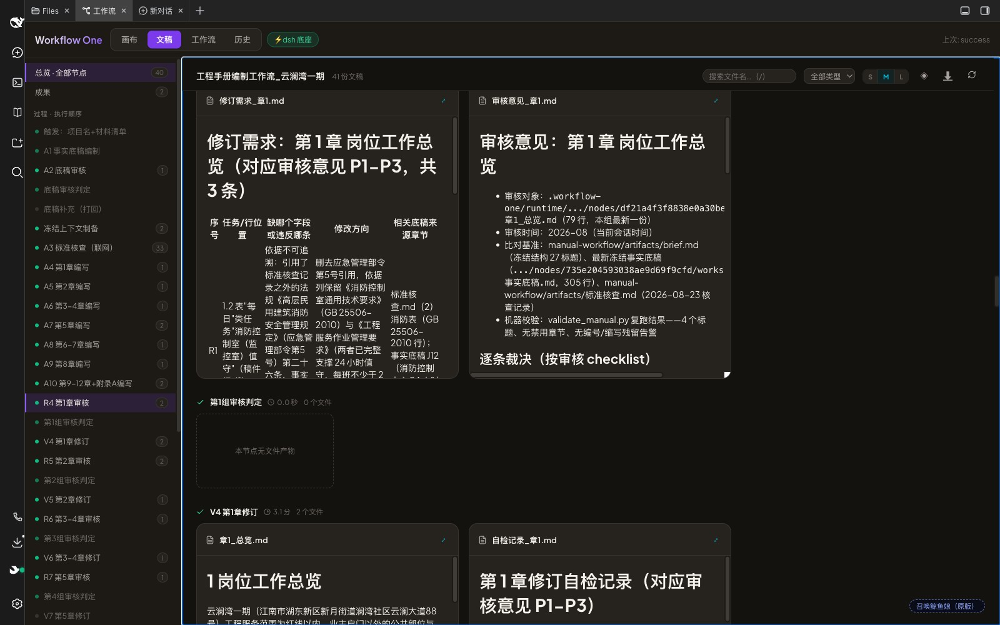
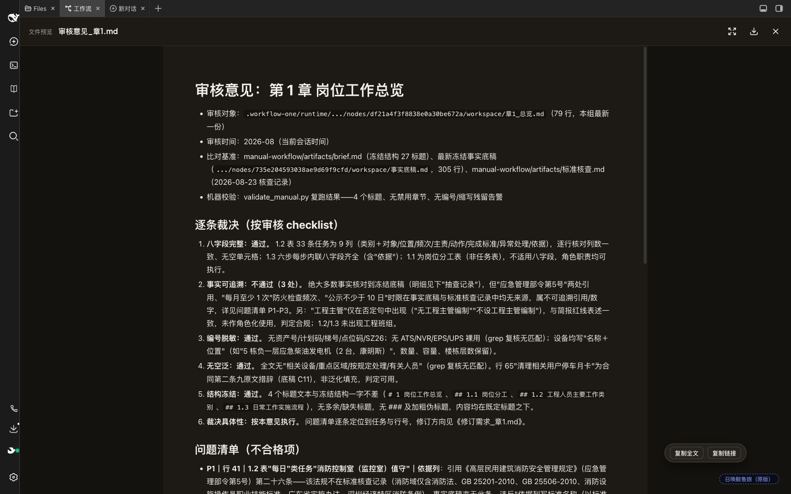

# 文稿视图（Doc Wall）

一次工作流运行会产生几十份过程文稿——底稿、核查单、修订记录、审核意见……散落在成果面板的文件清单里根本没法读。**文稿视图**把整块画布主区切换成「文档墙」：左侧按执行顺序列出全部节点，右侧以大卡片横向铺开该节点产出的所有文稿，Markdown 直接渲染成可读排版。

## 入口

顶部导航 **画布 | 文稿 | 工作流** 三态切换，点「文稿」即进入当前所看运行的文档墙；左侧「成果 / 过程节点」列表可随时跳转。视图状态写入 URL（`#docs/<runId>`），刷新保持、链接可分享。

## 核心能力

### 过程与成果一墙看全

- **成果带**：output 节点的最终交付物 + 回写链接置顶展示
- **过程节点**：按执行拓扑序铺开每个节点的产物；md / 图片 / 视频铺大卡，中间文件折成 chip 行
- 左侧节点行带状态点与文件计数，点击定位（总览模式）或过滤（单节点模式）

### 点卡即读，不离开墙

点任意卡片弹出页内全屏预览：Markdown 全文（表格、列表、代码块完整排版）、图片原比例、PDF/Office 走文档预览。预览态提供**复制全文**与**复制链接**，正文里行内引用的产物文件名自动变成可点击的预览链接。

### 实时流渲染

运行中的 agent 节点会出现「实时输出」流卡：优先展示**正在生成的目标文稿**（引擎随 agent-progress 推送文件尾部，标题显示「正在生成：xxx.md」及已写字节数），无文件产物时回退展示 agent 的对话文本。已完成节点的产物卡随跑随铺，运行结束流卡退场、落卡接管。

### 检索与浏览

| 能力 | 操作 |
| --- | --- |
| 文件名搜索 | toolbar 搜索框，或按 `/` 直接聚焦 |
| 类型过滤 | 全部 / 文档 / 图片 / 视频 |
| 只看有产物的节点 | toolbar ◈ 按钮 |
| 卡片密度 | S / M / L 三档卡宽（300 / 420 / 520px），偏好记忆 |
| 键盘导航 | `J` / `K`（或 `↑` `↓`）节点间移动，`Esc` 关预览，`/` 聚焦搜索 |
| 新文稿标记 | 上次阅读后新落盘的卡片带 NEW 标，离开视图自动记为已读 |
| 一键导出 | toolbar 下载按钮，打包本次运行全部产物为 zip |
| 新文稿提醒 | 画布视图期间运行落盘，「文稿」tab 挂圆点提示 |

## 工程实现（给维护者）

- 数据层 `web/src/doc-wall-data.js`：纯函数模型 `buildDocWallModel({ runResults, nodeStates, progressByNode, scopedArtifactUrl })`，磁盘事实投影 + SSE 实时叠加，node 直测
- 卡内正文上限 2000 字符（全文只进预览）；批量正文端点 `POST /wf1/api/artifacts/content` 一次拉全 run（预算 1.5MB，超预算回退单卡拉取）；懒挂载 + `React.memo` 控制重渲染
- 异常恢复原则：SSE 断线重连、成果落盘一律全量再投影，不做增量修补终态
- 续跑产物断链修复在引擎侧：持久化前把祖先运行可复用节点的产物物化拷贝进本次运行目录（`materializeResumedWorkspaces`），artifact 路由兜底再沿 `resumedFrom` 祖先链回退
